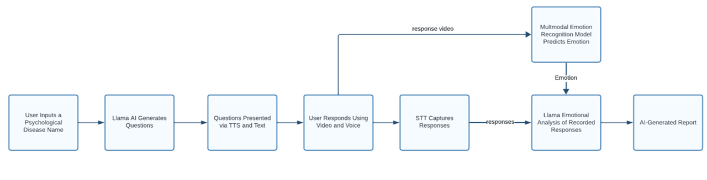

# Emotion Detection Deep Learning Model

## Inroduction
This project involves the development of an advanced Emotion Detection Deep Learning Model by integrating visual and audio models. The approach utilizes late fusion techniques to enhance the accuracy of emotion prediction.

## Table of Contents
- [Solution Architecture](#solution-architecture)
- [Fusion Implementation](#fusion-implementation)
  - [Method 1](#method-1)
  - [Method 2](#method-2)
  - [Method 3](#method-3)
  - [Method 4](#method-4)
  - [Method 5](#method-5)
- [Prototype Results](#prototype-results)
- [Enhancements to Audio-Visual Emotion Recognition Model](#enhancements-to-audio-visual-emotion-recognition-model)
  - [Initial Model Architecture](#initial-model-architecture)
  - [Limitations of Initial Model](#limitations-of-initial-model)
  - [Enhanced Model Architecture with Transformers](#enhanced-model-architecture-with-transformers)
  - [Training Process](#training-process)
  - [Benefits of the Enhanced Model](#benefits-of-the-enhanced-model)
- [Application Overview and Functionality](#application-overview-and-functionality)
  - [Workflow Overview](#workflow-overview)
  - [Speech-to-Text (STT) Functionality](#speech-to-text-stt-functionality)
  - [Llama Integration](#llama-integration)
  - [Text-to-Speech (TTS) Functionality](#text-to-speech-tts-functionality)
  - [Emotional Analysis Integration](#emotional-analysis-integration)
- [Future Directions](#future-directions)
- [Conclusion](#conclusion)

## Solution Architecture

The solution architecture integrates preexisting visual and audio models using late fusion techniques to enhance accuracy. The fusion of these models is detailed below, along with the project timeline and various implementation methods.

## Fusion Implementation

### Method 1

This method consolidates outputs from both models to produce final emotion predictions.

- **Changes:** No changes to individual models.
- **Fusion:**
  - 16 outputs (8 from each model) aggregated into 8 final predictions.

### Method 2

A more complex architecture that concatenates output representations and uses a linear layer for dimensional reduction.

- **Changes:**
  - Removed the last layer from both models.
  - Added a fully connected layer to the video model.
- **Fusion:**
  - Aggregated 2048 outputs (1024 from each model).
  - Reduced dimension to 8 using a linear layer.

### Method 3

Similar to Method 2 but employs average pooling along the temporal dimension.

- **Changes:**
  - Removed the last layer from both models.
  - Added an average pooling layer to the video model.
- **Fusion:**
  - Aggregated 2048 outputs.
  - Reduced dimension to 8 using a linear layer.

### Method 4

Enhances fusion by adding dropout for regularization and an ELU activation function.

- **Changes:**
  - Removed the last layer from both models.
  - Added average pooling to the video model.
- **Fusion:**
  - Aggregated 2048 outputs.
  - Reduced dimension to 1024 using a linear layer.
  - Introduced dropout and ELU activation.
  - Final predictions reduced to 8.

### Method 5

Adds complexity by incorporating dropout, ELU activation, and max pooling.

- **Changes:**
  - Removed the last layer from both models.
  - Added max pooling instead of average pooling.
- **Fusion:**
  - Aggregated 2048 outputs.
  - Reduced dimension to 1024 using a linear layer.
  - Introduced dropout and ELU activation.
  - Final predictions reduced to 8.

## Prototype Results

The model showed significant improvements in accuracy through different fusion strategies. Fusion 3, 4, and 5 demonstrated superior accuracy, particularly in real-life scenarios.

## Enhancements to Audio-Visual Emotion Recognition Model

### Initial Model Architecture

- **Audio Model:** Wav2Vec2 for robust audio feature extraction.
- **Visual Model:** EfficientFace for facial expression recognition.

### Limitations of Initial Model

- Inefficient in capturing temporal dependencies.
- Limited in modeling complex interactions between modalities.

### Enhanced Model Architecture with Transformers

- **Transformer Integration:** Captures temporal dependencies and complex interactions.
- **Training EfficientFace:** Fine-tuned for video data.
- **Training Process:**
  1. Phase 1: Trained the entire model with frozen Wav2Vec2.
  2. Phase 2: Trained EfficientFace and new architecture.
  3. Phase 3: Fine-tuned with IEMOCAP dataset.

### Benefits of the Enhanced Model

- Improved temporal understanding.
- Enhanced contextual modeling.
- Robust emotion recognition with 94% testing accuracy.

## Application Overview and Functionality

### Workflow Overview

1. User inputs a psychological disease name.
2. Llama AI generates questions.
3. Questions presented via TTS and text.
4. User responds using video and voice.
5. STT captures responses.
6. Emotional analysis of recorded responses.
7. AI-generated report for mental health professionals.

Figure 1: Applications workflow

### Speech-to-Text (STT) Functionality

Utilizes Vosk library for high-accuracy speech recognition in multiple languages.

### Llama Integration

Generates psychological reports and validates inputs using advanced language processing.

### Text-to-Speech (TTS) Functionality

Uses Google Text-to-Speech (gTTS) for converting text to spoken words and Pygame for audio playback.

### Emotional Analysis Integration

Enhances diagnostic accuracy by linking emotional cues with responses.
